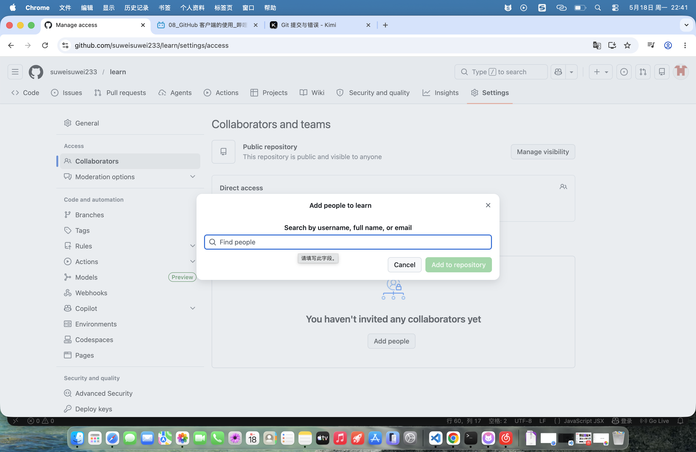
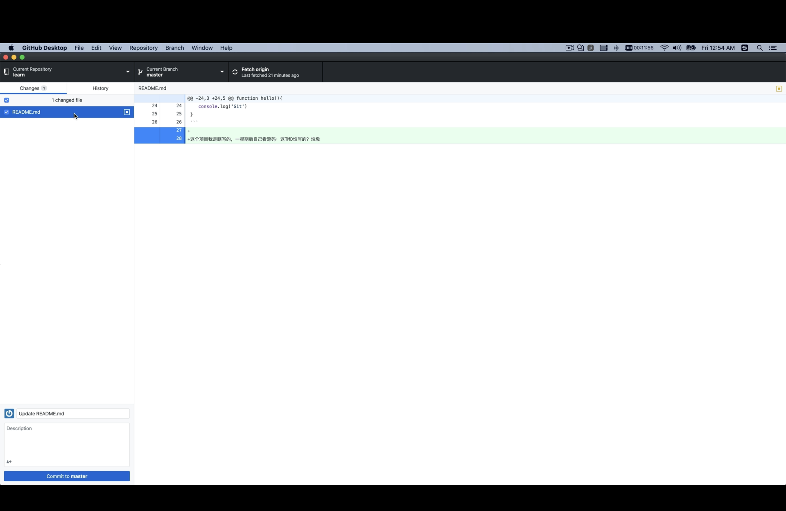
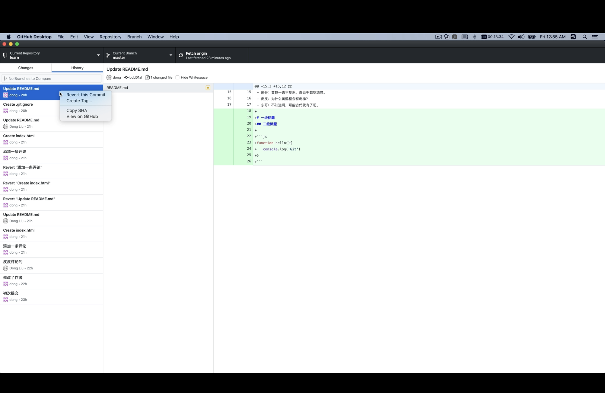

git add .

git add [file]

git commit -m "des"

git push origin main


如果出现冲突 可能是自己和别人的  可能是自己和自己的 

git pull --no-rebase origin main


> git 默认不会走代理  push代码有时候 会直接失败  你这种问题80%都是代理没有设置好，你开启了梯子，但是git工具没有设置相关的代理，导致git其实并没有走代理，一般输入以下命令设置代理即可


git config --global https.proxy 127.0.0.1:7897

git config --global http.proxy 127.0.0.1:7897 

fetch 是什么意思

git fetch 

//表示从远程仓库拉取 但是不覆盖

#include "stdio.h"


1. 点击＋键，即可将文件追踪，暂存文件更改
2. 点击 提交 可以添加 commit 在弹出的文件中 然后点击 提交 可以同步到 git 上 


ssh链接

`ssh-keygen`

git clone ssh_add

首次会提示一个信息 输入yes 就好了

项目->setting->Collaborators->Manage access -> add people 可以输入一个github的 邮箱账号 
可以将这个用户的添加进来 



使用上述这个操作的时候需要满足一个前提条件 就是添加的这个用户需要 通过ssh将自己的 ssh keys 增加到他自己的github上面


.gitignore 文件如何配置和添加

比如说我不要node_moudles 文件

比如说我不要 idea 文件

```c

.idea/
node_moudles/


# 移除 .idea 文件夹的追踪
git rm -r --cached .idea/

# 移除 node_modules 的追踪
git rm -r --cached node_modules/

# 如果有拼写错误的旧记录，也移除
git rm -r --cached idea/
git rm -r --cached node_moudles/

```

github desktop  如何取消 commit 的文件  还没有Push的文件





对于已经push的文件 应该使用如下的方式 如何回滚



这个方式会直接将原来对这个项目的修改都 删除 或者回撤掉 当然这个步骤也会被在历史记录上体现

代码冲突

commit 的时候会报错  你需要用fetch 去解决冲突


测试


